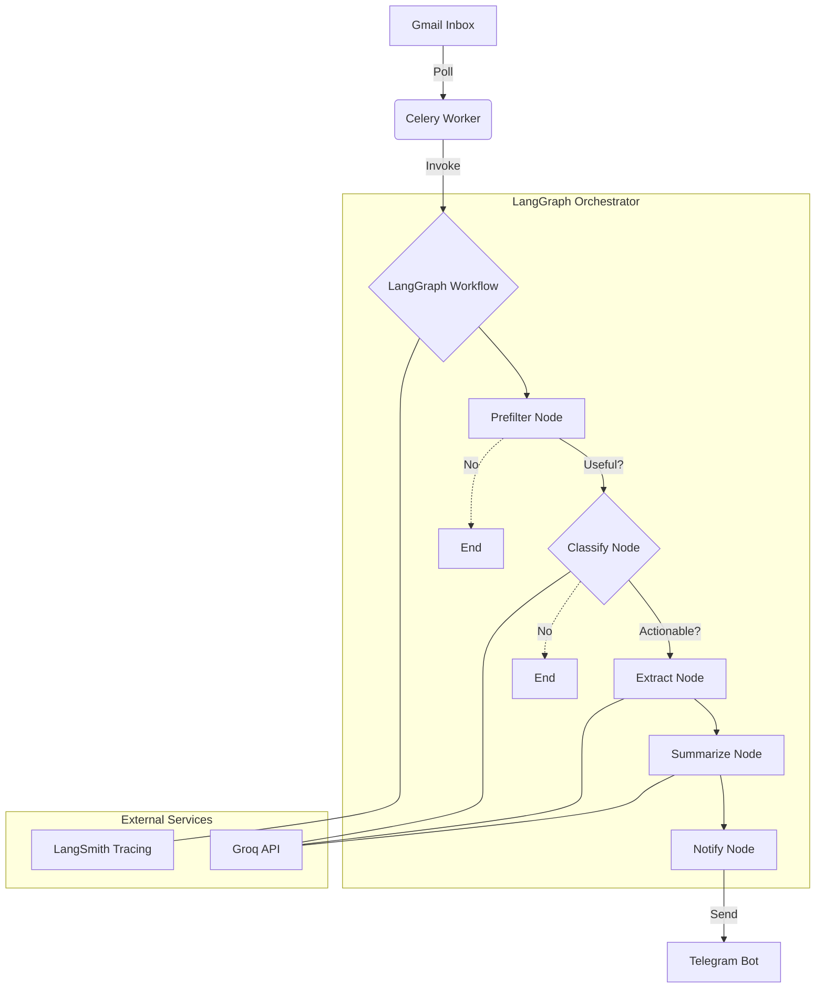

# AI Career Inbox Intelligence & Notification System

An AI-powered career workflow automation platform that monitors your Gmail inbox, intelligently identifies high-value career opportunities, and orchestrates notifications and workflows using LangGraph.

## 🚀 Overview

This platform is more than a simple keyword alert bot; it's a production-grade inbox intelligence system designed to:
*   **Monitor** Gmail activity in real-time.
*   **Filter** low-value job marketing, spam, and newsletters using a hybrid AI approach.
*   **Detect** critical career events: interview invitations, coding assessments, offers, and recruiter outreach.
*   **Orchestrate** complex workflows using **LangGraph**.
*   **Notify** via Telegram with structured, actionable summaries.

## 🛠 Tech Stack

*   **Backend:** FastAPI
*   **Orchestration:** LangGraph, LangChain
*   **Async Processing:** Redis + Celery
*   **AI Models:** Groq (Llama 3.3 70B)
*   **Integrations:** Gmail API, Telegram Bot API
*   **Observability:** LangSmith (Tracing & Monitoring)
*   **Infrastructure:** Docker

## 🏗 Architecture

The system follows a modular, event-driven architecture:



### Inbox Intelligence Pipeline

1.  **Fetch:** Polls Gmail for unread messages.
2.  **Prefilter:** Lightweight rule-based filtering (sender analysis, headers) to minimize LLM costs.
3.  **Classify:** LLM-based categorization using Groq (INTERVIEW, OFFER, REJECTION, etc.).
4.  **Extract:** Structured entity extraction (Company, Role, Date, Urgency).
5.  **Summarize:** Generates a concise, actionable summary.
6.  **Notify:** Sends a structured notification to Telegram.

## 📂 Project Structure

```text
app/
├── api/          # FastAPI routes
├── services/     # Business logic (Gmail, Notifier, Prefilter)
├── workflows/    # LangGraph orchestration logic (Nodes, State, Flow)
├── workers/      # Celery tasks & scheduled jobs
└── core/         # Config, settings, and shared utilities

infra/            # Docker & deployment configurations
tests/            # Unit and integration tests
```

## 🚦 Getting Started

### Prerequisites
*   Python 3.10+
*   Docker & Docker Compose
*   Redis
*   Google Cloud Console Project (with Gmail API enabled)
*   Groq API Key
*   Telegram Bot Token & Chat ID

### Installation

1.  **Clone the repository:**
    ```bash
    git clone <repo-url>
    cd ai-interview-notifier
    ```

2.  **Set up environment variables:**
    ```bash
    cp .env.example .env
    # Fill in your API keys and credentials
    ```

3.  **Run with Docker:**
    ```bash
    docker-compose up --build
    ```

## 📊 Observability

All AI workflows and LLM calls are traced using **LangSmith**. This provides:
*   Full visibility into LangGraph node transitions.
*   Detailed breakdown of LLM token usage and latency.
*   Debugging for classification and extraction failures.
*   Metadata-based trace searching (by email ID, subject, etc.).

## 🛡 Security

*   **OAuth2:** All Gmail interactions use secure OAuth2 flows.
*   **Environment-Driven:** No secrets are hardcoded; all configuration is managed via environment variables.
*   **Sanitization:** Sensitive email bodies are handled with care and not logged in raw format.

## 📄 License

[Specify License, e.g., MIT]
